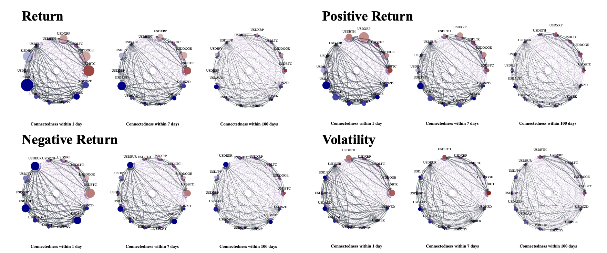
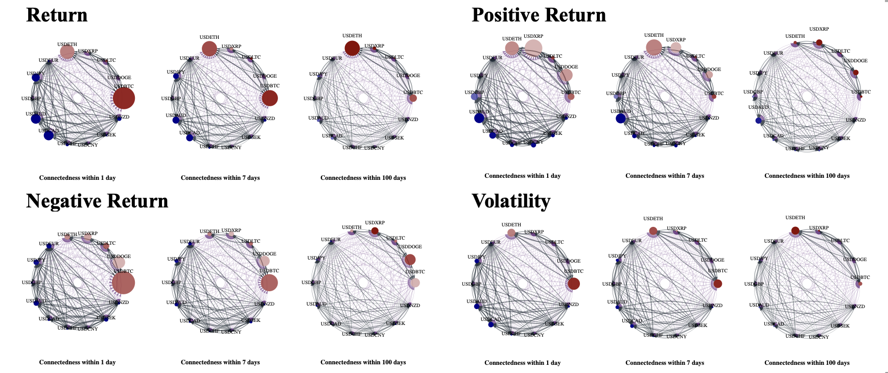
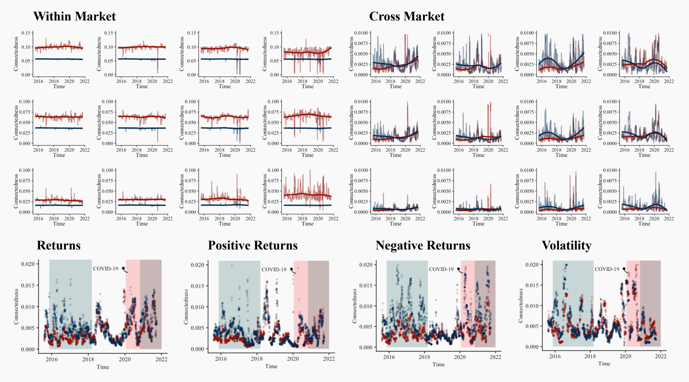
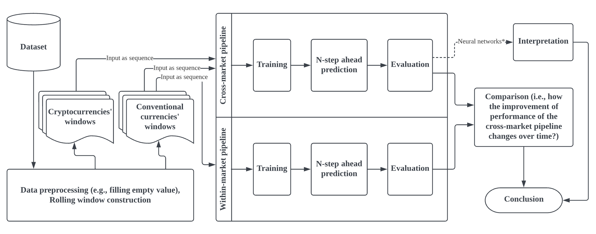
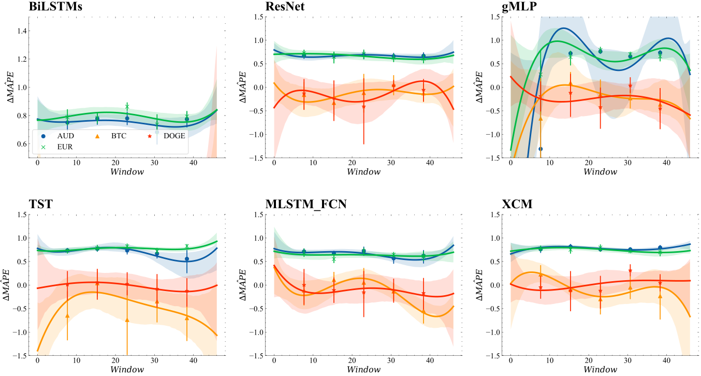

# __Asymmetric spillovers between cryptocurrencies and conventional currencies: the evolution of cross-market connectedness and predictive power__

 This work is licensed under a <a rel="license" href="http://creativecommons.org/licenses/by-nc/4.0/">Creative Commons Attribution-NonCommercial 4.0 International License</a>.

## __Summary__
This repository aims at sharing the code for paper _Asymmetric spillovers between cryptocurrencies and conventional currencies: the evolution of cross-market connectedness and predictive power_. The whole project has been divided into two section. The first section is for econometric analysis and the corresponding experiment R files are in folder <code>econometric</code>. The second section is for cross-market predictive power examination, the formal python scripts can be found in folder <code>ml</code>. <code>data</code> folder includes all prepared data for this study.

## __Results__
### __Part A__

__Figure 1A.__ The overall frequency connectedness of the 14 currencies from August 8, 2015 to January 1, 2022 (in-degree representation)

 

__Figure 1B.__ The overall frequency connectedness of the 14 currencies from August 8, 2015 to January 1, 2022 (out-degree representation)

__Replication:__ Run <code>network analysis.R</code> in <code>econometric</code> folder to reproduce the graph.

 

__Figure 2.__ The dynamic frequency connectedness of crypto and conventional currency markets from August 8, 2015 to January 1, 2020

__Replication:__ Run <code>dynamic_analysis.R</code> in <code>econometric</code> to reproduce the figure.

 

### __Part B__

__Figure 3.__ Experimental design for predictability comparison (BTC as an example)

 

__Figure 4.__ Rolling window-based predictability comparison via mean absolute percentage error (MAPE)

__Replication:__ Run <code>test.ipynb</code> in <code>notebook</code> to reproduce the figure.

 

__Figure 5.__ Comparing input currencies’ importance on the price return prediction of BTC, EUR, DOGE, and AUD, via DeepLift

__Replication:__ Run <code>test.ipynb</code> in <code>notebook</code> to reproduce the figure.

 

## __To-do List__
- [x] Data preparation
- [x] Econometric model construction
- [x] Connectedness calculation
- [x] Descriptive analysis
- [x] Visualization Part 1
- [x] Machine learning models development
- [x] Forecasting experiments
- [x] Visualization Part 2
