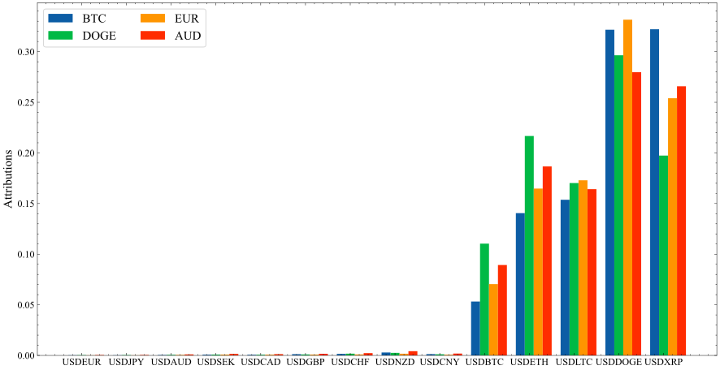

# __The evolution of spillovers between cryptocurrencies and conventional currencies: the complexity and dynamism of cross-market interaction__

 This work is licensed under a <a rel="license" href="http://creativecommons.org/licenses/by-nc/4.0/">Creative Commons Attribution-NonCommercial 4.0 International License</a>.

## __Summary__
This repository aims at sharing the code for paper _The evolution of spillovers between cryptocurrencies and conventional currencies: the complexity and dynamism of cross-market interaction_. The whole project has been divided into two section. The first section is for econometric analysis and the corresponding experiment R files are in folder <code>econometric</code>. The second section is for cross-market predictive power examination, the formal python scripts can be found in folder <code>ml</code>. <code>data</code> folder includes all prepared data for this study.

## __Results__
### __Part A__

__Figure 1A.__ The overall frequency connectedness of the 14 currencies from August 8, 2015 to January 1, 2022 (in-degree representation)

 

__Figure 1B.__ The overall frequency connectedness of the 14 currencies from August 8, 2015 to January 1, 2022 (out-degree representation)

__Replication:__ Run <code>network analysis.R</code> in <code>econometric</code> folder to reproduce the graph.

These two plots show the frequency connectedness measured based on returns, positive returns, negative returns, and volatility under different representation approaches. In the four bases of each figure, the three networks from left to right correspond to frequency connectedness in short-term (within one day), medium-term (within seven days), and long-term (within 100 days), respectively. Dark red nodes indicate cryptocurrencies and dark blue nodes represent traditional currencies. The color of linkages between currency pairs belonging to the same market is set to gray, otherwise, it is set to purple. The width of edges reflects the connectedness level. For Figure 1A, the opacity of nodes is determined by their within-market weighted in-degree, and the size of nodes signifies their cross-market weighted in-degree. For Figure 1B, the opacity and the size of nodes are set based on weighted out-degree.

Figure 1A and 1B further present the capability of studied currencies exporting and receiving different types of spillovers in a network view. Let’s consider the edges in the figures first. The edges of the networks all become thinner as the frequency band increases, which means that currencies are mostly connected in the short run (within 1 day). Besides, the width of the purple edges is much smaller than the grey ones, indicating that the connection between currencies within the same markets is much stronger than that across markets. Looking at the nodes, we can visually identify the capability of currencies on receiving and delivering within- and cross-market spillovers. For instance, the node corresponding to AUD is one of the largest and most opaque nodes among the traditional currency nodes in both indegree and outdegree representations of the four types of currency connectedness networks. This means that AUD receives and emits a substantial amount of different types of spillovers from the two markets at the same time, which makes it a universal two-way bridge, communicating all types of information from the two monetary systems in both directions. AUD is the only one of the 14 studied currencies that stably presents such characteristic in every situation. Some other currencies may also be considered as two-way bridges in some specific conditions (e.g., BTC for overall returns and volatility spillovers), but most currencies are only able to communicate within- and across-market in a selective way.

 

__Figure 2.__ The dynamic frequency connectedness of crypto and conventional currency markets from August 8, 2015 to January 1, 2020

__Replication:__ Run <code>dynamic_analysis.R</code> in <code>econometric</code> to reproduce the figure.

This figure aims at presenting the evolution of connectedness within and across markets over the last seven years. Both within market and cross market sections contain 12 subplots (3 rows and 4 columns). The columns in each section, from left to right, report the connectedness measurements based on returns, positive returns, negative returns, and volatility, respectively. The three rows, from top to bottom, correspond to different frequency bands, that is within one day, within one week, and within 100 days. The red lines and dark blue lines in the within market section represent spillovers within the cryptocurrency market and the conventional currency market. The red lines and dark blue lines in the cross-market section represent the overall spillovers from the cryptocurrency market to the conventional currency market and the overall spillovers from the conventional currency market to the cryptocurrency market. For the four subplots at the bottom of the figure, they are the dynamic cross-market connectedness without frequency decomposition. Periods with significant Bitcoin price explosivity are shaded in celadon; Pandemic periods are shaded in pink.

In response to the first part of the research question – the evolution of the connectedness between crypto and conventional currency markets, I conducted a dynamic connectedness analysis, and the results are presented in Figure 2. From the subplots in the within market section, it is obvious that the connectedness level within both two markets maintains stable in the studied periods. Plus, the connectedness within the cryptocurrency market is significantly stronger than the connectedness within the conventional currency market. It is worth noting that, although connectedness between cryptocurrencies remains unchanged in the long run, it fluctuates violently in small time windows, showing strong short-term instability. Then, turn to cross market section. Compared with within-market connectedness, the cross-market connectedness changes a lot in the past seven years. Visually, there is a positive trend in both returns-based connectedness and negative returns-based connectedness, implying that the mutual contamination of price changes, especially the negative price changes, across the two markets is increasing. Instead, the volatility-based connectedness across them decreases from 2020. Last but not the least, I found that the cross-market connectedness fluctuates significantly within the two bubble periods (shaded in celadon in the subplots) of cryptocurrencies. This result independently underscores the potential risks of investing in cryptocurrencies when cryptocurrencies present strong explosive behavior.

 

### __Part B__

__Figure 3.__ Experimental design for predictability comparison (BTC as an example)

To answer the second research question, that is whether the interaction between currencies in the two markets are economically important, I designed a deep learning-based framework to conduct the examination. Specifically, the framework checks whether including cross-market information brings additional prediction power to currencies’ price return. The framework is constituted by within-market pipeline and cross-market pipeline. For the within-market pipeline, it uses historical return time series of currencies in its local market to do a 30 step-ahead prediction, and for the cross-market pipeline, it is inputted with the historical return of currencies from both markets to do the prediction. After tunning and training, the outputs of the two pipelines are compared. If the cross-market pipeline’s prediction loss is significantly lower than the prediction loss of the within-market pipeline, then I conclude that the cross-market interaction can bring unignorable influence to the change of return of the predicted currency. To also measure the change of predictability, a rolling window strategy is employed in the framework. The comparison process runs iteratively by shifting a 3-year long time window forward over the data set 1 month at a time. I tested several neural nets to check the consistency of the results. In the end, using the best model (i.e., the model with lowest average mean absolute error in the cross-market pipeline), the contribution of each currencies’ information in the prediction is computed for interpretation purposes. Figure 3 presents an example workflow diagram for the case of BTC return prediction.

 

__Figure 4.__ Rolling window-based predictability comparison via mean absolute percentage error (MAPE)

__Replication:__ Run <code>test.ipynb</code> in <code>notebook</code> to reproduce the figure.

Figure 4 visualizes the comparison results of the two pipelines under the six prediction neural architectures. The horizontal axis is time window index, Window, and the vertical axis is the reduction in MAPE after additional cross-market information, ∆MAPE. The fitted polynomial regression curves represent the dynamic of the change of the model’s performance. In the six subplots, the ∆MAPE of AUD and EUR is positive in all the windows, however, the ∆MAPE of BTC and DOGE seems only fluctuating randomly around 0 during the studied period. This dynamic analysis further demonstrates that the spillovers between cryptocurrencies and conventional currencies are asymmetric - only the spillovers from crypto coins to conventional currencies are at a functional level. Moreover, starting from the 40th time window frame, ∆MAPE exhibits a slight growing trend, which just further confirmed that the monetary spillovers are increasing during recent years.

 

__Figure 5.__ Comparing input currencies’ importance on the price return prediction of BTC, EUR, DOGE, and AUD, via DeepLift

__Replication:__ Run <code>test.ipynb</code> in <code>notebook</code> to reproduce the figure.

To build trust and inject explainability to the trained neural models with inputs from both markets, I further investigated the feature attribution (i.e., the attribution of each currencies’ historical return) of the model with best performance, BiLSTM, via DeepLift, a method for decomposing the output prediction of a neural network on a specific input by backpropagating the contributions of all neurons in the network to every feature of the input (Shrikumar et al., 2017). The interpretation was conducted on the prediction tasks of BTC, DOGE, EUR, and AUD. The 14 indexes on the vertical axis are the inputted 14 currencies’ historical return time series. Obviously, in the case of both cryptocurrencies return prediction and traditional currencies return prediction, BiLSTM learned the majority of useful information from the cryptocurrency sector, and among them, DOGE and XRP contribute most. This finding indicates that cryptocurrency market is less efficient and mostly isolated from the influence of conventional currency market, however, intriguingly, it presents an early warning effect to the dynamic of conventional currencies, which is not expected.

 

## __To-do List__
- [x] Data preparation
- [x] Econometric model construction
- [x] Connectedness calculation
- [x] Descriptive analysis
- [x] Visualization Part 1
- [x] Machine learning models development
- [x] Forecasting experiments
- [x] Visualization Part 2
